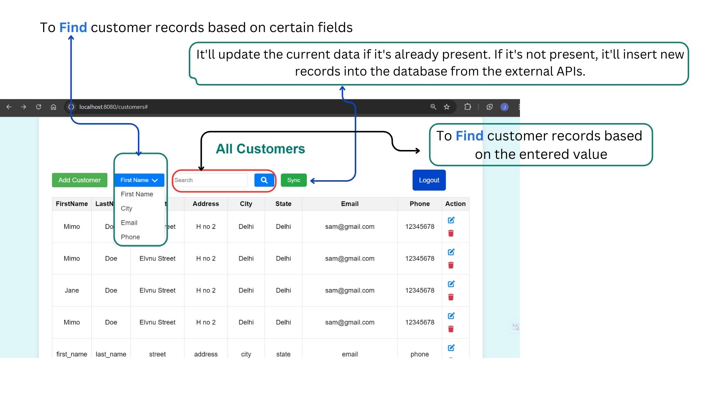

# Customer Management Application

## Table of Contents
- [Introduction](#introduction)
- [Screenshots](#ui-screenshots)
- [Features](#features)
- [Technologies Used](#technologies-used)
- [Setup Instructions](#setup-instructions)
- [Usage](#usage)
- [API Endpoints](#api-endpoints)

## Introduction
The Customer Management Application is a web-based application designed to manage customer data efficiently. It allows users to add, view, update, delete, and search for customers. The application also supports synchronization of customer data from an external API.

## UI Screenshots





## Features
- Add new customers
- View customer details
- Update existing customer information
- Delete customers
- Search for customers based on various fields
- Synchronize customer data from an external API

## Technologies Used
- Java
- Spring Boot
- Spring Security
- JPA (Java Persistence API)
- Hibernate
- MySQL
- HTML, CSS, JavaScript
- Thymeleaf (for server-side rendering)
- RESTful APIs

## Setup Instructions

### Prerequisites
- Java 11 or higher
- Maven
- MySQL

### Database Setup
1. Create a database named `customer_management`.
2. Update the `application.properties` file with your MySQL database credentials.

### Application Setup
1. Clone the repository:
    ```sh
    git clone https://github.com/your-username/customer-management-app.git
    cd customer-management-app
    ```
2. Build the project:
    ```sh
    mvn clean install
    ```
3. Run the application:
    ```sh
    mvn spring-boot:run
    ```

## Usage
1. Open your browser and go to `http://localhost:8080/home`.
2. Use the application to manage customer data.

## API Endpoints

### Customer Endpoints
- **Add Customer**
  - `POST /api/save_customer`
  - Request Body: JSON containing customer details

- **Get Customer By ID**
  - `GET /api/customers/{id}`

- **Get All Customers**
  - `GET /api/customers`

- **Delete Customer**
  - `DELETE /api/customers/{id}`

- **Search Customers**
  - `GET /api/customers/search?field={field}&value={value}`

### Synchronization Endpoint
- **Sync Customers**
  - `POST /api/sync_customers`
  - Request Header: Bearer Token

